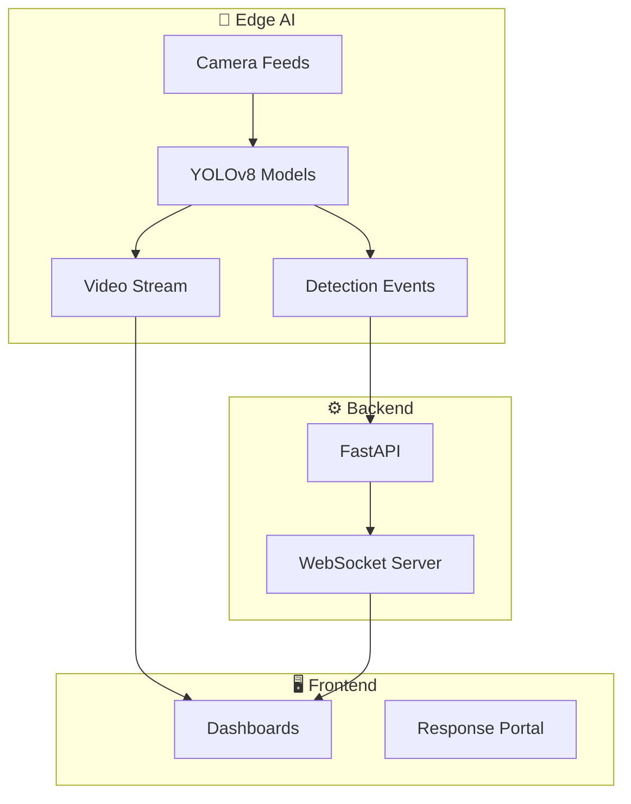

<div align="center">


<a href="" target="_blank">
  
</a>

# ResQ

### AI-Powered Multi-Hazard Emergency Intelligence & Response System


**Team Chernobyl · Smart Emergency Systems**

*Saving lives through AI — before it's too late.*

</div>

---

## 🌐 Overview

**ResQ** is a next-generation **AI-powered emergency response platform** designed to detect, analyze, and respond to **multiple real-world hazards** in real time.

ResQ is also a plug-and-play indoor crisis-response demo for hotels and large buildings. It includes a modern web UI, backend API, editable floor graph, sample map, BLE/QR people simulation, hazard simulation, and safest-route calculation.

Unlike traditional systems that focus on a single domain, ResQ integrates:

* 🚑 Medical emergencies
* 🔥 Fire hazards
* 🚓 Security threats
* 🚦 Traffic intelligence
* 🌪️ Disaster monitoring

into a **single unified intelligent platform**.

> 💡 **Vision:** Build a system that doesn’t just react — but **anticipates and prevents crises**.

---

## 🚀 Run Locally

```bash
npm install
npm run dev
```

Open http://localhost:3000. The API runs on http://localhost:4000.

---

## 🧪 Neon Setup

1. Create a Neon PostgreSQL database.
2. Copy .env.example to .env.
3. Set DATABASE_URL to the Neon pooled or direct connection string.
4. Apply the schema:

```bash
npm run db:push
```

The demo API currently runs with in-memory state so it is easy to present anywhere. The Neon schema in src/server/db/schema.sql is ready for the production persistence layer.

---

## 🗺️ DWG/DXF Floor Map Requirements

Best results come from a clean 2D floor drawing:

* One floor per DWG/DXF file.
* Model-space geometry, not a paper layout screenshot.
* Real-world scale where possible.
* Separate layers preferred: WALLS, ROOMS, DOORS, STAIRS, EXITS, FIRE_EQUIPMENT, CAMERAS, SENSORS, BEACONS, QR_POINTS.
* Avoid exploded title blocks, unrelated furniture, heavy hatches, and many duplicate lines in the routing drawing.

DXF files are parsed directly for preview geometry, including lines, lightweight polylines, legacy polylines, circles, arcs, TEXT, and MTEXT labels. Closed room polygons on room-like layers are converted into editable room nodes at the room center; labels inside those polygons become the node names. Corridor, path, hallway, exit, stair, camera, sensor, BLE, QR, actuator, and extinguisher layers/text can also create editable node candidates. DWG files are accepted, stored, and marked needs_converter unless the deployment configures a converter such as LibreDWG or ODA File Converter. Admins can always place and edit nodes manually after upload.

---

## Phase 1 Features

* Admin dashboard: upload map, place/edit/delete nodes, connect graph edges, simulate hazards, simulate BLE/QR people locations, calculate route, and review final nodes.
* Staff dashboard: monitor active hazards, people locations, route state, exits, and response actions.
* User dashboard: pick a simulated user, confirm QR checkpoint, and view step-by-step evacuation guidance.
* Dark and light theme toggle.
* Sample hotel floor map with rooms, corridors, exits, devices, BLE beacon, QR checkpoint, and people.
* Route engine blocks unsafe nodes/edges and evaluates all exits.

---

## Edge AI Contract

Camera hazard detection should run locally on an edge server inside the building. The cloud/backend should receive only event data:

```json
{
  "cameraId": "cam-lobby",
  "hazardType": "fire",
  "confidence": 0.91,
  "timestamp": "2026-04-26T00:00:00.000Z",
  "bbox": [120, 80, 260, 220],
  "nearestNodeId": "junction-main"
}
```

Use an Ultralytics-compatible fire/smoke YOLO model as a starting point, then retrain and validate with the building's real camera angles before safety-critical use.

---

## 🚨 The Problem

<div align="center">

| Problem                          | Impact                              |
| -------------------------------- | ----------------------------------- |
| 🚑 Delayed emergency response    | Loss of critical Golden Hour        |
| 🔥 No real-time hazard detection | Fires escalate before intervention  |
| 🚓 Lack of unified monitoring    | Disconnected systems slow decisions |
| 📊 No centralized dashboard      | Authorities lack visibility         |
| 🧠 Manual decision-making        | Slower and error-prone              |

</div>

---

## 💡 Our Solution

ResQ operates on **three intelligent layers**:

```
┌────────────────────────────────────────────────────────────┐
│                          RESQ                              │
├──────────────────┬──────────────────┬──────────────────────┤
│   🤖 AI DETECTION │ 🚨 RESPONSE ENGINE │ 📊 LIVE DASHBOARD  │
│                  │                  │                      │
│ YOLO detects     │ Auto alerts      │ Multi-hazard view    │
│ fire, vehicles,  │ + routing        │ Smart dispatch   │
│ people, threats  │ Green corridors  │ System analytics     │
├──────────────────┼──────────────────┼──────────────────────┤
│ Edge inference   │ SMS / Call APIs  │ Control panels       │
│ Video pipelines  │ Smart routing    │ Admin overrides      │
└──────────────────┴──────────────────┴──────────────────────┘
```

---

## 🏗️ System Architecture



---

## ✨ Key Features

### 🧠 Multi-Hazard Dashboards

ResQ includes **6 specialized dashboards**:

* 🔥 Fire Monitoring Dashboard
* 🚑 Medical Emergency Dashboard
* 🚓 Security Threat Dashboard
* 🚦 Traffic Intelligence Dashboard
* 🌪️ Disaster Management Dashboard
* 📊 Unified Command Dashboard

Each dashboard has its **own UI, alerts, and controls**.

---

### 🎥 AI Video Detection

* YOLOv8-based real-time detection
* Works on:

  * CCTV feeds
  * Uploaded videos
  * Live streams
* Detects:

  * Fire & smoke
  * Vehicles
  * Crowds
  * Suspicious activity

---

### 🗺️ Smart Response System

* Google Maps routing
* Live GPS tracking
* Emergency vehicle navigation
* Green corridor support

---

### 📡 Real-Time Communication

* WebSocket-based live updates
* Instant alerts to dashboards
* Event streaming from AI → UI

---

### 🚨 Alert System

* SMS alerts
* Call triggers (future)
* Priority-based emergency handling

---

## 🤖 AI Module

Located in: `services/edge-ai/`

### Capabilities

* Multi-model YOLO detection
* Frame-by-frame processing
* Real-time event generation
* MJPEG video streaming

### Pipeline

```
Video → YOLO → Detection → API → WebSocket → Dashboard
```

---

## 🛠️ Tech Stack

| Layer    | Technology            |
| -------- | --------------------- |
| Frontend | Next.js 16 + Tailwind |
| Backend  | FastAPI               |
| AI/ML    | YOLOv8 (Ultralytics)  |
| Realtime | WebSockets            |
| Maps     | Google Maps API       |
| Database | Neon PostgreSQL       |
| Video    | OpenCV + MJPEG        |

---

## 📁 Project Structure

```
resQ/
├── apps/web/
├── services/api/
├── services/edge-ai/
├── docs/
├── scripts/
```

---

## 🚀 Getting Started

Follow the [Run Locally](#-run-locally) and [Neon Setup](#-neon-setup) sections above for the current demo workflow.

---

## 🔑 Environment Variables

```env
DATABASE_URL=your_neon_connection_string
```

---

## 📊 Dashboards & Routes

| Route                 | Description       |
| --------------------- | ----------------- |
| `/dashboard`          | Unified dashboard |
| `/dashboard/fire`     | Fire monitoring   |
| `/dashboard/medical`  | Medical           |
| `/dashboard/security` | Security          |
| `/dashboard/traffic`  | Traffic           |
| `/dashboard/disaster` | Disaster          |

---

## 🚑 Emergency System Flow

```
Detection → Alert → Dispatch → Tracking → Resolution
```

---

## 🤝 Team

<div align="center">

**Team Chernobyl**

| Area             | Contribution               |
| ---------------- | -------------------------- |
| 🖥️ Development  | Full-stack + UI            |
| 🤖 AI            | YOLO + detection pipelines |
| 🏗️ Architecture | System design              |
| 🎨 UI/UX         | Dashboard experiences      |

</div>

---

## 📄 License

MIT License

---

<div align="center">

**ResQ** · *AI for Emergency Intelligence*

Built with ❤️ by **Team Chernobyl**

</div>
